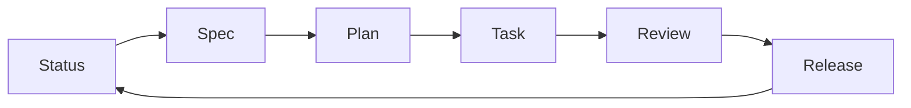

# OpenCode Autopilot

A squad-based autonomous development system built on the **Sprint Workflow State Machine**. This system orchestrates specialized agents (Architecture, Backend, UI, Security, QA) to deliver high-fidelity features with strict engineering discipline.

## 🚀 Workflow

The system operates in a deterministic loop. Each command analyzes the current state (via Git and Filesystem) and suggests the optimal next step.

1.  **`/ap auto <goal>`**: **The "Set & Forget" Mode**. Autonomous full sprint.
2.  **`/ap status`**: Audit current state (branch, pending tasks, blockers).
2.  **`/ap spec <goal>`**: Define requirements in `docs/specs/` with unique AC-IDs.
3.  **`/ap plan <AC-ID>`**: Generate an atomic task list in `.opencode/plans/`.
4.  **`/ap task <plan> <Txx>`**: Execute a single task with strict **TDD** (Red -> Green -> Refactor) on a feature branch.
5.  **`/ap review`**: Final quality gate (Verify tests, security, and contracts).
6.  **`/ap release`**: Safely merge feature branch into `main` (auto-rollback on failure).

## 🛠 Engineering Constraints

-   **TDD is Mandatory**: No code is accepted without deterministic test proof (Quinn will block you).
-   **Traceability (AC-ID)**: Every task and commit must map to an Acceptance Criterion ID defined in the spec.
-   **Safe Merging**: Merges to `main` use `--no-ff`. Any post-merge failure triggers an immediate rollback to the feature branch.
-   **Zero Secrets**: Hardcoded secrets or leaked environment variables trigger a security BLOCK (Viktor).

## 👥 The Squad

| Agent | Role | Focus |
| :--- | :--- | :--- |
| **Elias** | Lead | Orchestration, Integration, Task Management |
| **Silas** | Architect | Type-First Design, ADRs, Crate Structure |
| **Vera** | Spec | Requirements, Gherkin Scenarios, AC-IDs |
| **Torin** | Backend | High-Performance Rust, Async, DB Migrations |
| **Lyra** | Frontend | Dioxus/Leptos UI, Tailwind v4, UX States |
| **Quinn** | QA | TDD Enforcement, Snapshot Testing, Coverage |
| **Viktor** | Security | Vuln Scanning, Supply Chain, Safety Review |

## 📦 Prerequisites

-   **Git**: All work happens on feature branches.
-   **Modular Rules**: Standards are loaded on-demand from `@skills/` (see `AGENTS.md`).
-   **pre-commit**: Run `prek install` to ensure local lint/test gates.

---
*Configured in `~/.config/opencode/`*
